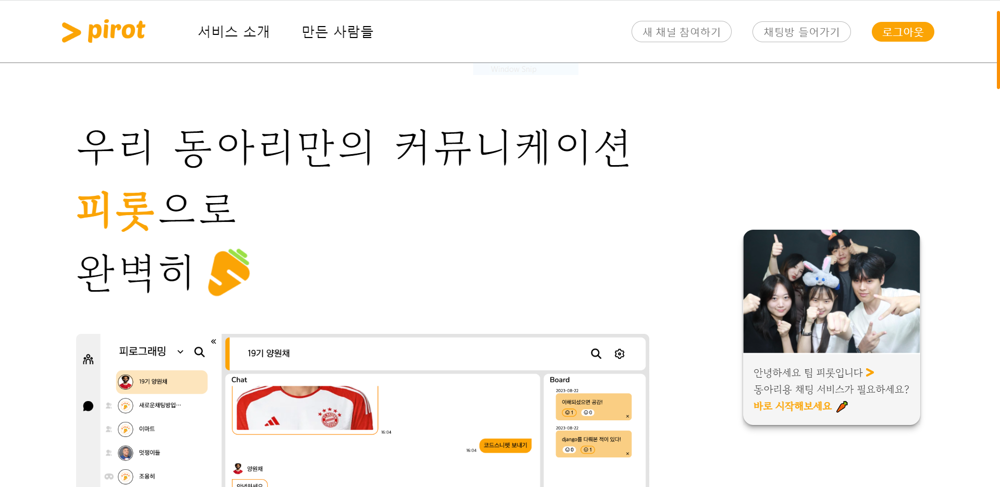

# 🥕 Django-Pirot

## 당신의 동아리를 위한 완벽한 커뮤니케이션

깔 - 끔한 업무용 채팅 웹 서비스, 피롯입니다.

## [Pirot으로 놀러오세요!](https://hello.pirot.p-e.kr/)

✅ 코드 스니펫 전송

✅ 마크다운 문법 채팅 지원

✅ Visual Studio Code 코드 입력창 지원

✅ 이미지 전송 및 저장

---

✅ 단체 채팅방, 익명 채팅방, 개인 채팅방 개설 및 초대, 퇴장

✅ 익명 채팅방 프로필 익명성 강화

✅ 채팅방 별 게시글 작성 및 공감

✅ 채팅방 입력창 잠금

---

✅ 채널 개설 및 관리

✅ 채널 기본 프로필 지정

✅ 채널 운영진 권한 관리

✅ 채널 구성원 퇴출

✅ 개인 프로필 설정

✅ 라이트 모드, 다크 모드, Black & White 모드

|||
|---|---|
|||

## 기술 스택

&nbsp;&nbsp;&nbsp;&nbsp;

&nbsp;&nbsp;&nbsp;&nbsp;

## 피롯 웹 개발 팀

|||
|---|---|
|[정혜인](https://github.com/hyeinj)|[김선우](https://github.com/SSunwo)|
|- 백엔드 - Naver Cloud PlatForm SMS 문자인증 - 회원 가입 및 로그인 - 채팅방 입력창 잠금/해제 - 익명 채팅방 프로필 수정|- 프론트엔드|

||||
|---|---|---|
|[장민서](https://github.com/mingdodev)|[양원채](https://github.com/ywonchae1)|[박석류](https://github.com/pomiryu)|
|- 백엔드 - 실시간 소켓 게시판 및 공감 - 채널 개설 요청 및 가입 - 채널 관리 CRUD - 채널 운영진 권한 설정 - 채널 가입 랜덤 코드 생성 - vs code 코드 스니펫 전송 - 채팅방 테마 설정|- 팀장 - 백엔드 - Socket.IO Python 서버 구축 - Socket.IO JavaScript 클라이언트 구축 - MySQL 데이터베이스 구축 - 단체/익명/개인채팅방 CRUD - 채팅 페이지네이션 - 실시간 이미지 전송 - 친구 즐겨찾기 - 채널 개설 요청 및 비밀번호 변경 메일 알림 - 회원정보 수정 - AWS EC2 배포|- 프론트엔드 - 모바일 반응형 - JS 애니메이션 - 채팅방 디자인 및 테마 - 마크다운 채팅 스타일링 - 채팅방 vs code 코드 입력 - 182운전병|

> 2023.08.22.